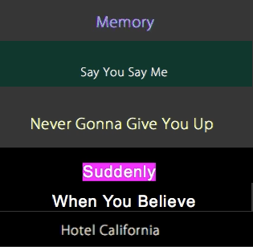
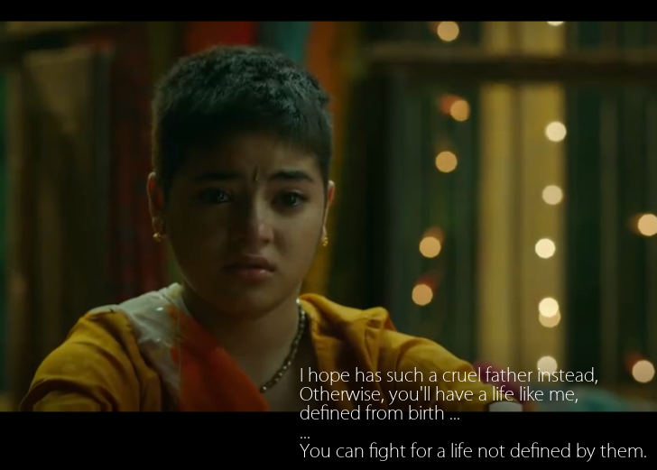
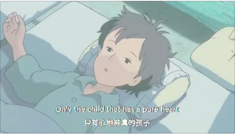

  

# LittleFox 

LittleFox  is a designedly small util developed to synthesis video or audio to movie with subtitles. With the help of it, you can burn your favourite mp3 to video with lyrics words in several minutes, synchronise some words to an exists video, or just scale the screen size of your videos to slim them so that you can very easily share them on social websites.  

Style Samples
========
  

Screenshot
========
  

Sample output movies
========
1. Say You Say Me - Lionel Richie.mp4  
2. Memory - Andrew Lloyd Webber.mp4  
3. Hotel California - Eagles.mp4  
4. Never Gonna Give You Up - Rick Astley.mp4  
5. Suddenly - Billy Ocean.mp4  
6. When You Believe - Whitney Houston.mp4  
7. Sailing - Rod Stewart.mp4  
8. Everything I Do, I Do It for You - Bryan Adams.mp4  
9. Take My Breath Away - Berlin.mp4  

Sample MTV
========
  
Two song from movie [Dangal 2016](https://www.imdb.com/title/tt5074352/), music TV made by LyricsMaker and LittleFox.  
1. Haanikaarak Baapu  
2. Naina  

The lyrics sheet styles please refer Haanikaarak Baapu.txt and Naina.txt.  

  
A MTV made from movie [となりのトトロ (My Neighbor Totoro, Tonari no Totoro, 龍貓)](https://www.imdb.com/title/tt0096283/), made by LyricsMaker and LittleFox.  

More info
========
[LittleFox Homepage](http://sevenuc.com/en/littlefox.html)  

